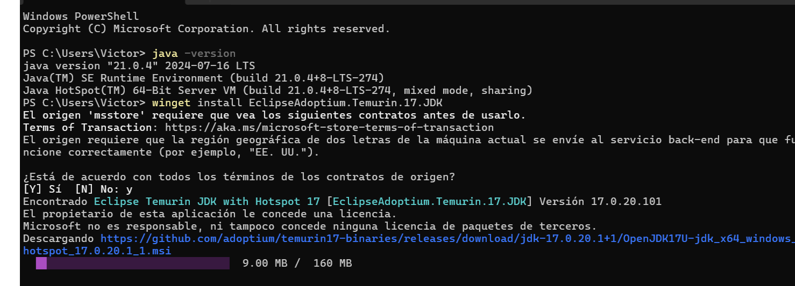
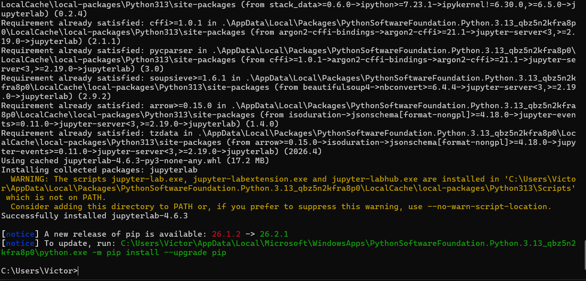
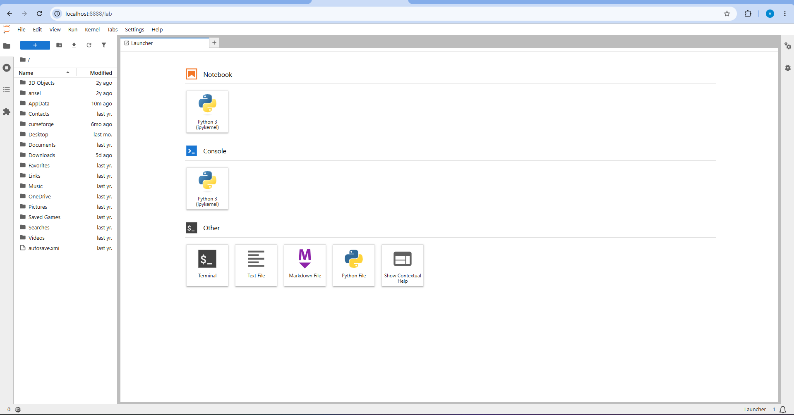

# Práctica 1: Entornos de Desarrollo para Scala

En este documento se detallan los pasos de instalación, configuración y ejecución de los tres entornos de desarrollo exigidos para trabajar con Scala 2.12.21 y Java JDK 17 sobre Windows 11.

---

## 1.1 Entorno 1 — JupyterLab + Almond Kernel + Scala 2.12.21

### 1. Instalación de requisitos previos
Para asegurar el correcto funcionamiento del entorno en Windows 11, se instalaron y configuraron las siguientes dependencias:
*   **Java JDK 17:** Se instaló la versión requerida para soportar las herramientas de construcción.
*   **Coursier y Python:** Herramientas base para la descarga de dependencias y ejecución del servidor.

### 2. Instalación y ejecución de JupyterLab
Se procedió a la instalación mediante el gestor de paquetes de Python y se arrancó el servidor web local.

### 3. Instalación de Almond Kernel
Para habilitar la compatibilidad con Scala, se instaló Almond especificando la versión requerida. Una vez completado, la opción aparece en el menú de inicio (Launcher) de JupyterLab.

### 4. Verificación y ejecución de código
Se creó un nuevo Notebook bajo el kernel de Scala. Se verificó la versión en uso y se comprobaron las funcionalidades interactivas evaluando variables, operaciones y listas con éxito.

---

## 1.2 Entorno 2 — Visual Studio Code + Metals + Scala 2.12.21 + JDK 17 + sbt

### 1. Verificación del JDK 17 y sbt
Se comprobó la correcta instalación del JDK 17 y de la herramienta de construcción sbt en la terminal.

### 2. Configuración de Visual Studio Code y Metals
Se instaló la extensión oficial de Scala (Metals) desde el marketplace para añadir soporte completo para el lenguaje.

### 3. Creación y configuración del proyecto
Se creó el directorio del proyecto con la estructura estándar y se configuró el archivo `build.sbt`. Al detectarlo, Metals reconoció automáticamente el proyecto.

### 4. Compilación y Ejecución
Se compiló el código fuente y se ejecutó mediante las herramientas integradas, verificando la salida esperada.

---

## 1.3 Entorno 3 — IntelliJ IDEA Community + Scala 2.12.21 + sbt

### 1. Instalación y Configuración del IDE
Se instaló IntelliJ IDEA Community Edition junto con el plugin oficial de Scala, y se configuró el proyecto para utilizar el JDK 17.

### 2. Creación del proyecto sbt y Código
Se generó el proyecto sbt configurado para la versión 2.12.21 de Scala y se desarrolló el archivo principal.

### 3. Compilación y Ejecución
El código se compiló y ejecutó directamente desde el terminal integrado utilizando los comandos de sbt.

