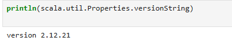
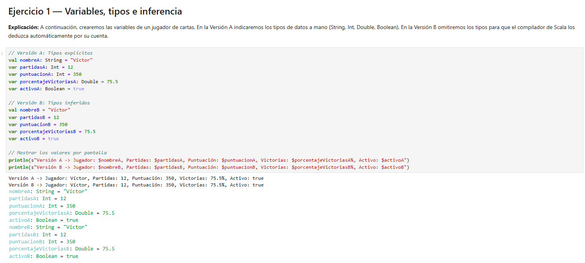
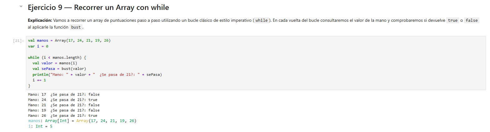
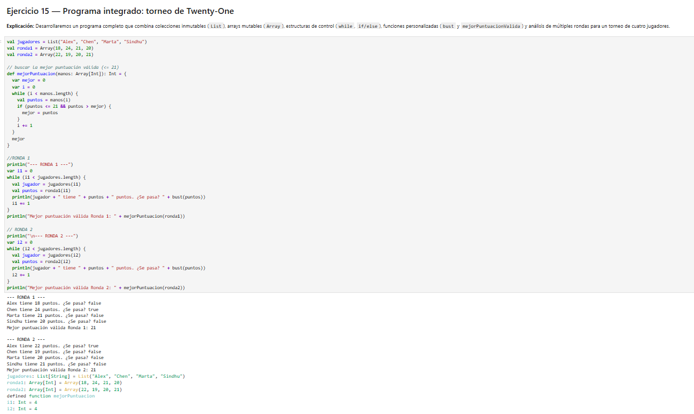

# Práctica 1 - Parte 2: Programación con Scala en JupyterLab

En este documento se detalla la resolución de los 15 ejercicios prácticos sobre los fundamentos de programación en Scala utilizando JupyterLab, abriendo conceptos desde variables (`val` y `var`), tipos de datos, inferencia, funciones, estructuras de control (`while`, `foreach`, `if/else`), hasta colecciones inmutables (`List`) y mutables (`Array`).

---

## 2.1 Configuración y Entorno de Ejecución

### 1. Entorno JupyterLab y Almond Kernel
El desarrollo se ha llevado a cabo de forma interactiva utilizando celdas de código y Markdown integradas en el entorno web, ejecutándose bajo el núcleo de Almond para Scala 2.12.21.

---

## 2.2 Desarrollo y Evidencias de los Ejercicios

### 1. Variables, tipos, inferencia y mutabilidad (Ejercicios 1 a 3)
Se estudió la diferencia entre declaraciones explícitas e inferidas, la asignación inmutable (`val`) frente a la mutable (`var`), y el comportamiento de precisión con tipos numéricos (`Double` y `Float`).

### 2. Estructuras de control y bucles (Ejercicios 9 y 13)
Se implementaron recorridos de colecciones mediante estructuras de control iterativas tradicionales (`while`) y enfoques funcionales basados en orden superior (`foreach`).

### 3. Programa Integrado: Torneo de Twenty-One (Ejercicio 15)
Como cierre de la práctica, se desarrolló un programa completo combinando listas de jugadores, arrays de puntuaciones por ronda, la función auxiliar `bust` para control de límites, funciones propias de filtrado y análisis de estilos funcionales e imperativos.

---

## 2.3 Acceso al Notebook

El código ejecutable completo con los 15 ejercicios documentados se encuentra disponible en el siguiente archivo del repositorio:
* **[Ver Notebook de la Parte 2 (parte2-scala.ipynb)](parte2-scala.ipynb)**