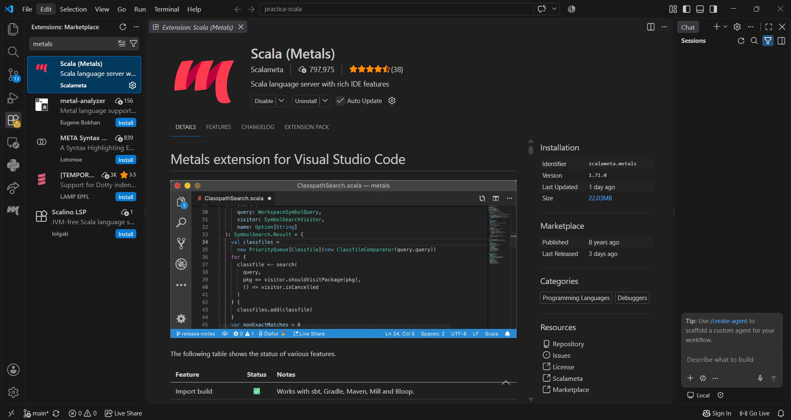
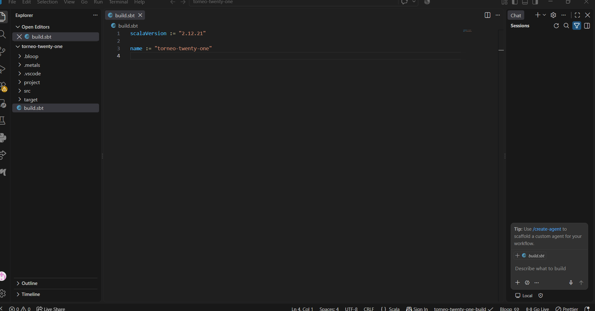
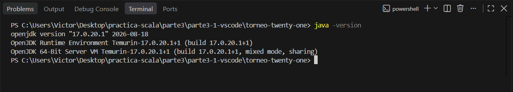
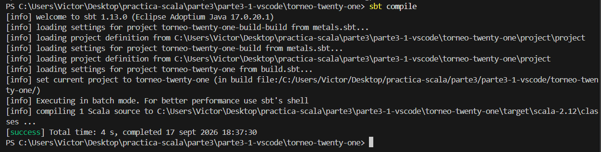
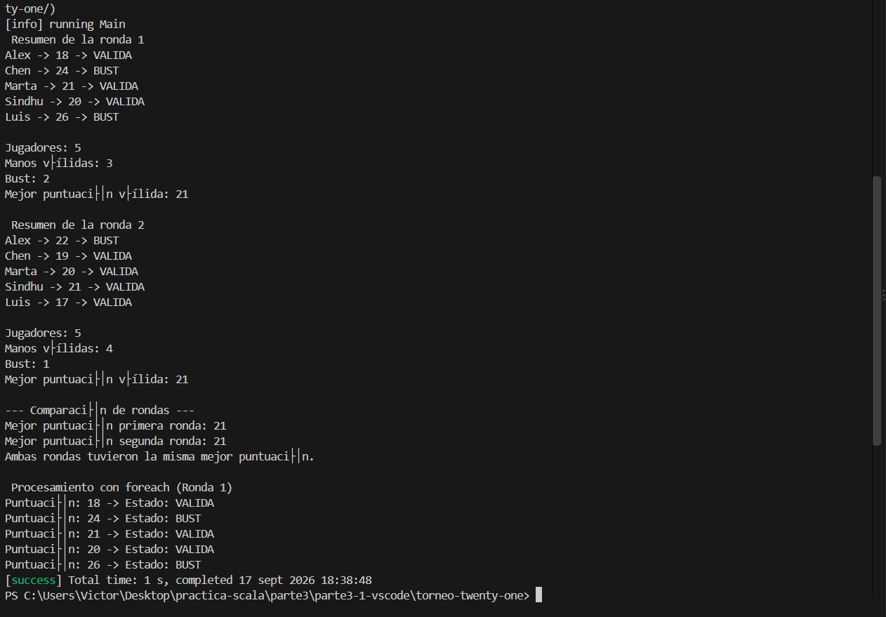

# Parte 3.1 — Torneo de Twenty-One

## 1. Qué hace el programa
Esta aplicación es un analizador de resultados para un torneo del juego de cartas Twenty-One. Evalúa las puntuaciones de un grupo de jugadores a lo largo de dos rondas, determina qué jugadores se han pasado de 21 ("Bust") y cuáles tienen puntuaciones válidas, calcula la mejor puntuación de cada ronda y compara los resultados finales para determinar qué ronda obtuvo la puntuación más alta. 

## 2. Cómo está organizado
El proyecto utiliza una estructura sbt estándar dentro del entorno Visual Studio Code con la extensión Metals:
- `build.sbt`: Define la configuración del proyecto y la versión específica de Scala solicitada (2.12.21).
- `src/main/scala/Main.scala`: Archivo fuente principal que contiene el objeto `Main`, las colecciones de datos, las funciones lógicas de evaluación y los algoritmos de procesamiento iterativo.

## 3. Qué funciones se han creado
- `bust(puntuacion: Int): Boolean`: Recibe una puntuación y devuelve `true` si el jugador se ha pasado de 21.
- `estadoMano(puntuacion: Int): String`: Evalúa una puntuación y devuelve la cadena de texto "VALIDA" o "BUST" apoyándose en la función `bust`.
- `mejorMano(handA: Int, handB: Int): Int`: Compara dos puntuaciones utilizando una estructura condicional (`if`, `else if`, `else`) y devuelve la mayor que no supere el límite de 21, o 0 si ambas se pasan.

## 4. Qué colecciones se utilizan
- **`Array`**: Utilizado para almacenar las puntuaciones numéricas de los jugadores en la primera y segunda ronda.
- **`List`**: Utilizado para almacenar de forma ordenada los nombres de los jugadores.

**Comparativa: while vs foreach**
En este proyecto se han implementado dos formas de recorrer las colecciones:
1. El bucle `while` necesita obligatoriamente una variable mutable para el contador (`var i = 0`) para poder acceder a los índices, además de tener que incrementarlo manualmente al final de cada iteración (`i += 1`).
2. El bucle `foreach` no necesita contador ni variables mutables de control, delegando la iteración directamente en la colección. Se aproxima mucho más al estilo funcional, resultando en un código más conciso y declarativo.

## 5. Qué resultados se obtienen
La salida por consola muestra:
1. El estado individual de cada jugador en la Ronda 1.
2. Un resumen estadístico de la Ronda 1 (jugadores, manos válidas, bust, mejor puntuación).
3. El estado individual y resumen estadístico de la Ronda 2.
4. Una comparativa final indicando qué ronda obtuvo el mejor resultado absoluto.
5. Una demostración funcional utilizando el método `foreach`.

## 6. Problemas durante el desarrollo y cómo se solucionaron
- **Problema:** Metals no detectaba inicialmente la estructura del proyecto sbt al abrir la carpeta raíz del repositorio completo.
  **Solución:** Se solucionó abriendo directamente la carpeta específica del proyecto (`torneo-twenty-one`) en Visual Studio Code para que Metals identificara correctamente el archivo `build.sbt` en la raíz e importara el entorno.

## 7. Capturas de pantalla

**Visual Studio Code con Metals activo:**

**Configuración Scala 2.12.21 en sbt:**

**Verificación de JDK 17:**

**Compilación correcta (sbt compile):**

**Ejecución y salida completa (sbt run):**

