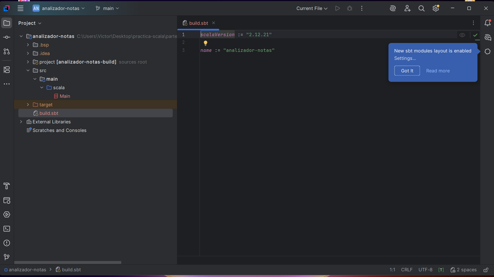
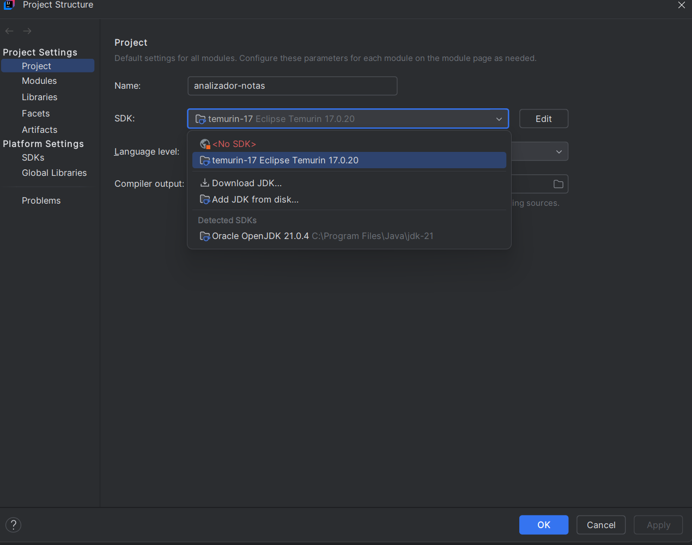
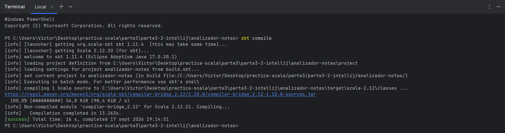
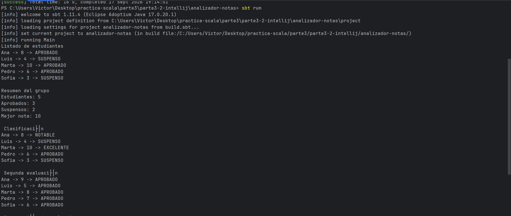
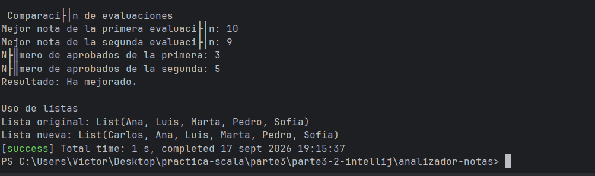

# Parte 3.2 — Analizador de calificaciones

## 1. Qué hace el programa
Esta aplicación analiza las calificaciones de un grupo de estudiantes a lo largo de dos evaluaciones. Determina qué alumnos aprueban o suspenden, calcula estadísticas (número de aprobados, suspensos y nota máxima), clasifica las notas en rangos (Excelente, Notable, Aprobado, Suspenso) y compara los resultados de ambas evaluaciones para concluir si el grupo ha mejorado o empeorado. Además, demuestra la inmutabilidad de las listas al añadir nuevos alumnos.

## 2. Cómo está organizado
El proyecto utiliza una estructura sbt estándar dentro del entorno IntelliJ IDEA Community:
- `build.sbt`: Define la configuración del proyecto y la versión de Scala (2.12.21).
- `src/main/scala/Main.scala`: Contiene el objeto `Main` con toda la lógica de ejecución, variables y funciones.

## 3. Qué funciones se han creado
- `aprobado(nota: Int): Boolean`: Devuelve `true` si la nota es 5 o superior.
- `estadoNota(nota: Int): String`: Devuelve "APROBADO" o "SUSPENSO" basándose en la función anterior.
- `maxNota(a: Int, b: Int): Int`: Compara dos notas y devuelve la mayor utilizando condicionales `if/else`.
- `clasificacion(nota: Int): String`: Devuelve una clasificación de texto (EXCELENTE, NOTABLE, etc.) utilizando `if, else if y else`.

## 4. Qué colecciones se utilizan
- **`Array`**: Utilizado para almacenar las notas de la primera y segunda evaluación, ya que tienen un tamaño fijo y conocido.
- **`List`**: Utilizado para almacenar los nombres de los estudiantes. 

**Explicación sobre la inmutabilidad de las Listas:**
Al incorporar a "Carlos" mediante el operador `::` (`"Carlos" :: estudiantes`), la lista original no se modifica. Esto ocurre porque en Scala, la colección `List` es inmutable por defecto. El operador `::` (cons) crea y devuelve una **nueva lista** con el elemento añadido al principio, manteniendo intacta la lista original. Esto es un principio clave de la programación funcional para evitar efectos secundarios.

## 5. Qué resultados se obtienen
La salida por consola muestra:
1. El listado inicial de estudiantes con su nota y estado.
2. Un resumen estadístico de la primera evaluación.
3. Una clasificación detallada por cada estudiante.
4. El resumen de la segunda evaluación.
5. Una comparativa final indicando si el rendimiento del grupo subió, bajó o se mantuvo.
6. La demostración de la creación de la nueva lista con "Carlos".

## 6. Problemas durante el desarrollo y cómo se solucionaron
- **Problema:** IntelliJ IDEA no reconocía inicialmente el JDK 17, mostrando el archivo `Main.scala` con errores de sintaxis en el editor.
  **Solución:** Se solucionó accediendo a `File > Project Structure > Project` y seleccionando manualmente el SDK 17.
- **Problema:** La salida de consola era demasiado extensa para capturarla en una sola imagen durante la ejecución de `sbt run`.
  **Solución:** Se amplió la terminal y se tomaron dos capturas secuenciales para registrar la totalidad de los datos procesados.

## 7. Capturas de pantalla
*(Las imágenes demuestran el entorno de trabajo y la ejecución del código)*

**Entorno IntelliJ, sbt y Plugin Scala activos:**

**Configuración JDK 17:**

**Compilación correcta (sbt compile):**

**Ejecución y salida (sbt run - Parte 1):**

**Ejecución y salida (sbt run - Parte 2):**
